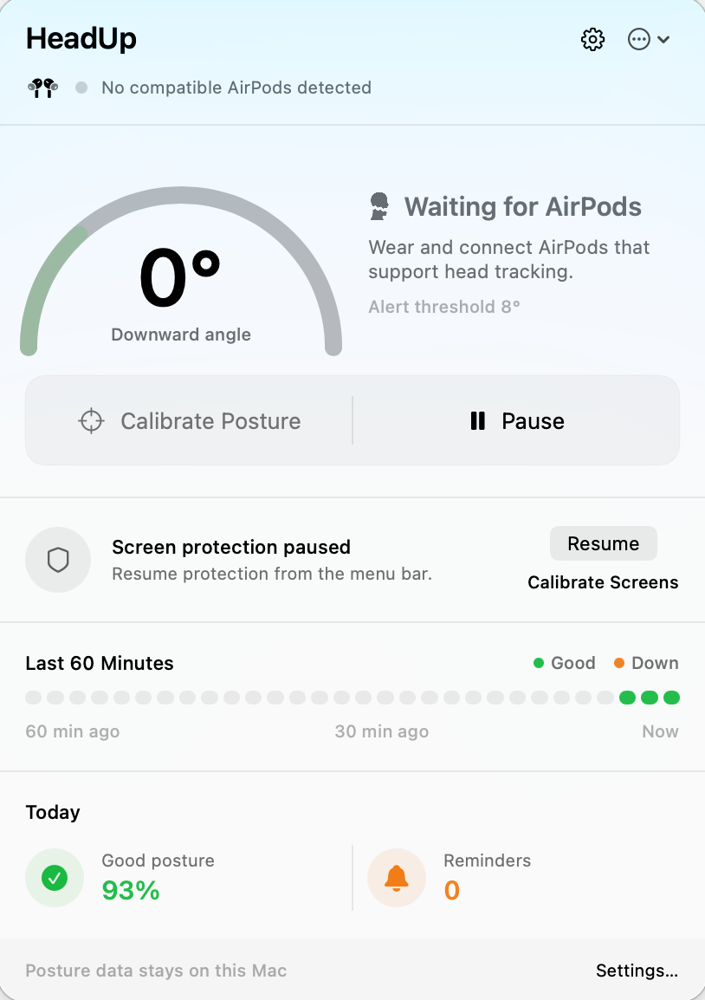
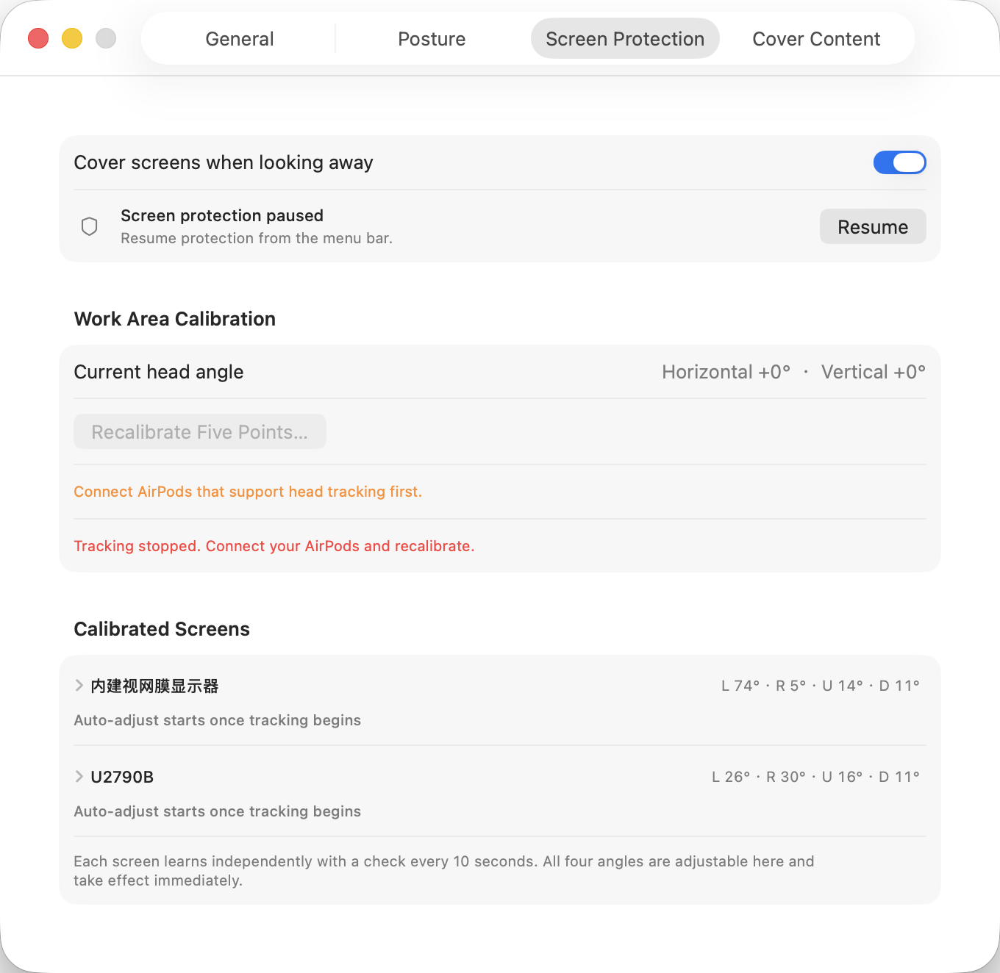
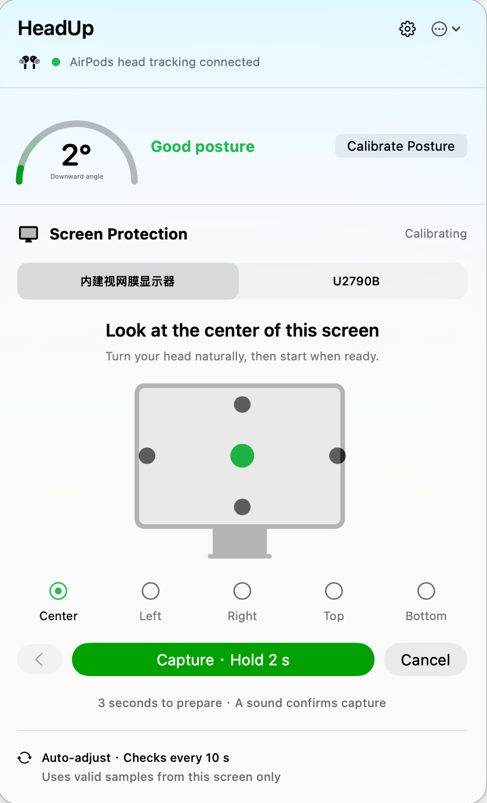
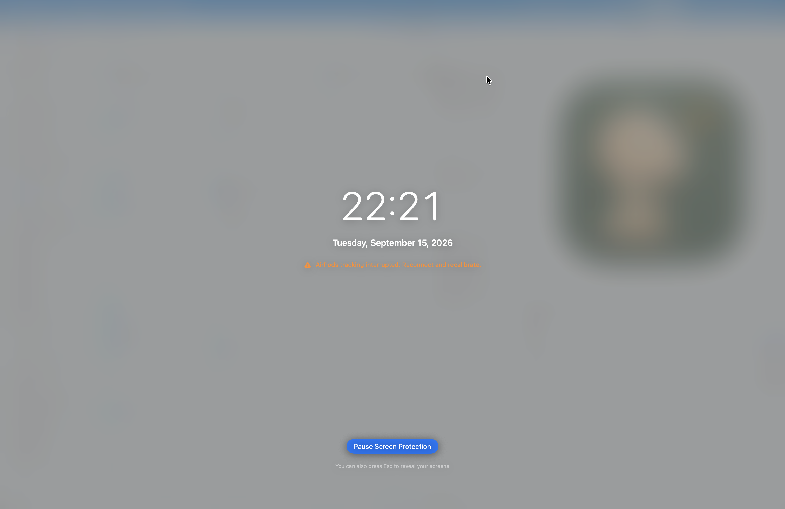
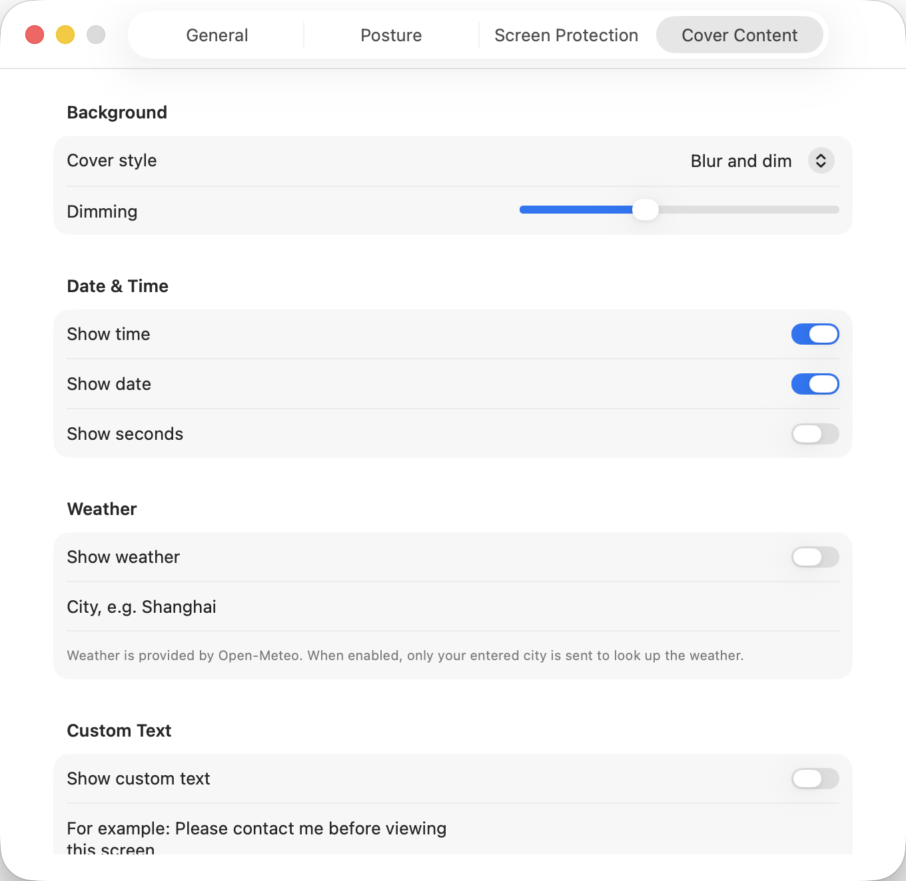
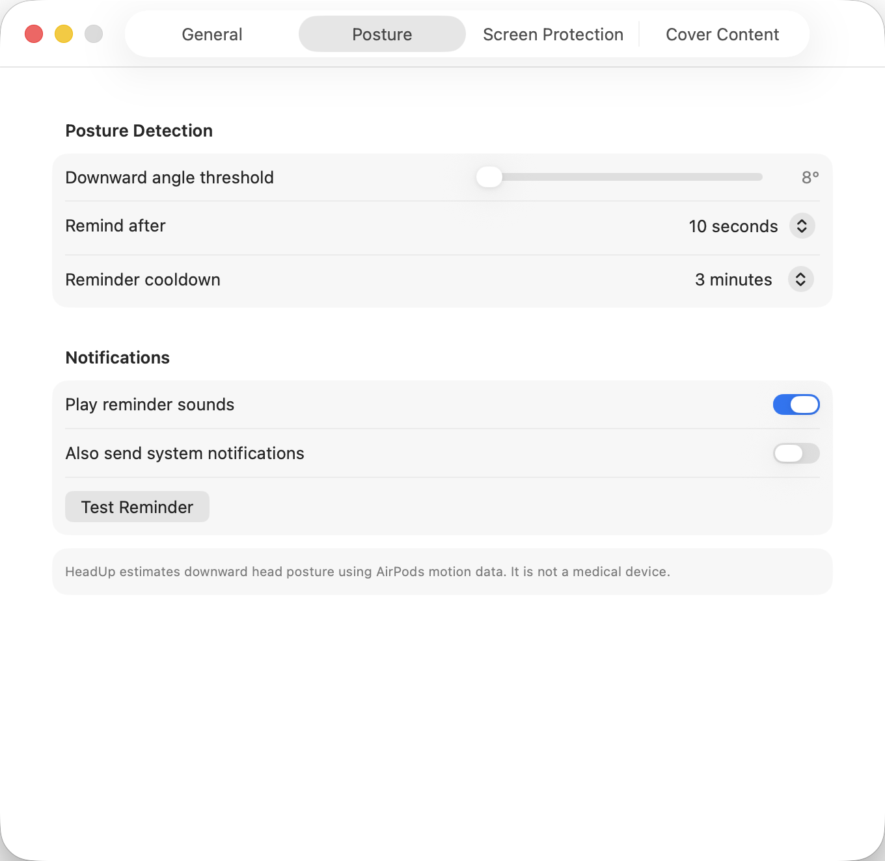
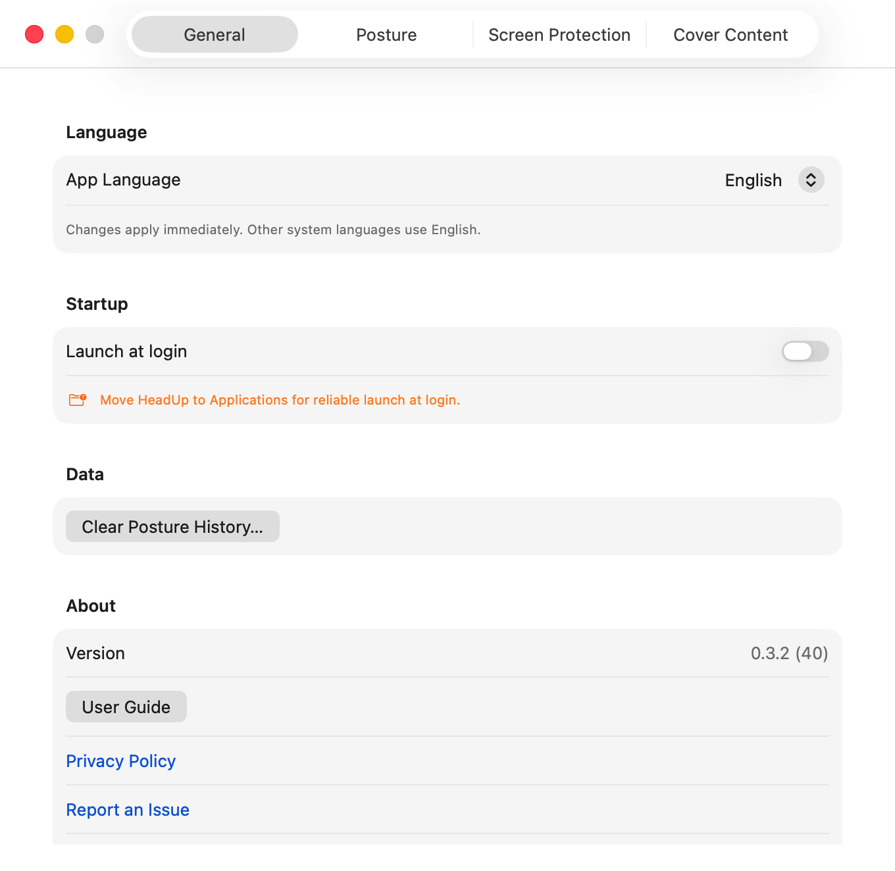

# HeadUp

[English](README.md) · [简体中文](README.zh-CN.md)

**While you work with AirPods, HeadUp looks after your neck and automatically covers your screens the moment you turn away.** It lives in the Mac menu bar and uses no camera. Face your screens again and the cover disappears — no clicks required.

<p align="center">
  
</p>

## Highlights

- **Automatic privacy cover**: blurs and dims every display when your head leaves your work area, restores instantly when you look back
- **Four-direction tracking**: independent boundaries for left, right, up, and down
- **Multiple displays**: protects every screen at once, with four independently adjustable angles per display
- **Drift auto-correction**: each display learns and cancels slow head-pose drift, so boundaries stay accurate over long sessions
- **Posture reminders**: a notification, sound, or on-screen prompt when your head stays lowered too long
- **A cover that informs**: show the time, weather, or a custom message over a blurred or solid background
- **AirPods-friendly**: removing one earbud or a brief reconnect never wipes your calibration; press `Esc` to reveal screens at any time

## Protect your screens when you turn away

In an office or shared workspace, when you turn to speak with a coworker, look down for something, or leave your desk, HeadUp blurs and dims every display the instant your head crosses a work boundary — reducing the chance that nearby people see private chats, customer information, or internal documents.

<p align="center">
  
</p>

After enabling protection, HeadUp guides you through capturing the center, left, right, top, and bottom of each screen in your workspace.

<p align="center">
  
</p>

- Detects turns left and right as well as looking up and down — not just one direction
- Supports multiple displays and protects them all at once
- **Fine-tune all four angles of every display independently; changes apply instantly with no recalibration**
- Built-in drift correction learns and offsets slow AirPods pose drift per display, so boundaries stay put even after hours of wear
- Restores automatically when you face your work area again — no click or unlock
- Temporarily removing one AirPod keeps your setup: a single display resumes on its own after a reconnect, and a multi-display setup just needs one tap on "Aim here" while facing the screen center — neither requires recalibrating
- Press `Esc` to reveal your screens immediately and pause protection

If AirPods tracking is interrupted while the cover is active, the cover stays in place and clearly asks you to reconnect and recalibrate before resuming protection.

<p align="center">
  
</p>

The cover can also be a calm information page. Choose what it shows:

<p align="center">
  
</p>

- System date and time, with optional seconds
- Current weather (powered by Open-Meteo, off by default)
- Your own message, such as “Back soon” or a note for office visitors
- A blurred and dimmed desktop or a solid-color background, with adjustable dimming

## Remind you when your head stays lowered

HeadUp learns the difference between your upright position and the way you naturally look down. If your head stays lowered longer than the time you choose, it reminds you to move with a notification, sound, or on-screen prompt.

<p align="center">
  
</p>

The menu bar panel always shows your current downward angle, the reminder countdown, posture changes over the last 60 minutes, and today's good-posture percentage (see the panel at the top).

## Get started in three minutes

1. Connect head-tracking AirPods to your Mac and open HeadUp.
2. Allow Motion & Fitness access when prompted.
3. Complete the two-step posture setup: look straight at your screen, then lower your head naturally.
4. To use screen protection, open **Settings → Screen Protection**, turn it on, and look at the center, far-left, far-right, highest, and lowest points of your work area when prompted.
5. Open **Settings → Overlay Content** to choose the cover style and whether to show the time, weather, or a custom message.

The four-direction setup adapts HeadUp to your desk — single displays, side-by-side displays, and stacked displays can all have different work areas, and all four angles of each display remain adjustable afterward. Once setup is complete, normal earbud changes and brief disconnections will not make you repeat it.

General settings let you choose the app language, start HeadUp at login, and access update, privacy, and support links.

<p align="center">
  
</p>

A short guide appears on first launch; you can reopen it from the menu in the top-right corner of the menu bar panel.

## Privacy

HeadUp uses head-direction data from your AirPods. It does not use a camera and cannot tell which item on your screen you are looking at. Head-angle data and posture history stay on this Mac.

Weather is off by default. When enabled, HeadUp sends only the city you entered to Open-Meteo. See [PRIVACY.md](PRIVACY.md) for more details.

## Requirements

- macOS 14 or later
- AirPods or Beats that support head tracking and are connected to your Mac
- Motion & Fitness permission; notification permission is optional

## Download and install

The project does not yet provide a publicly distributed build notarized by Apple. Official builds will be published on [GitHub Releases](https://github.com/breezedeus/head-up/releases). For now, you can build it from source:

```bash
./script/build_and_run.sh
```

The app is created at `dist/HeadUp.app`. If you have trouble with the connection, permissions, or reminders, see [SUPPORT.md](SUPPORT.md).

## Developer information

### Common commands

```bash
# Build and launch; the app lands in dist/HeadUp.app
./script/build_and_run.sh

# Build without launching
./script/build_and_run.sh build

# Launch and follow logs (--telemetry filters to this app's subsystem)
./script/build_and_run.sh --logs
./script/build_and_run.sh --telemetry

# Debug under lldb
./script/build_and_run.sh --debug

# Tests; --verify launches once and checks the process stays up
swift test
./script/build_and_run.sh --verify
```

`HEADUP_PREVIEW=1` compiles with `-DHEADUP_DEBUG`, keeping the per-second drift diagnostics (sample attribution, speed gating, corrected centers and offsets per screen). These hot-path logs are compiled out of normal builds.

```bash
# Preview debug build, pair with --logs to watch the drift traces
HEADUP_PREVIEW=1 ./script/build_and_run.sh --logs

# Preview release package: ad-hoc signed, no Developer ID and no notarization
HEADUP_PREVIEW=1 HEADUP_SIGNING_IDENTITY=- ./script/package_release.sh
```

Both land in `dist/release/`. The `-preview` suffix goes on the archive name only; unzipping still gives you a plain `HeadUp.app`:

| Command | Archive | Unzips to |
| --- | --- | --- |
| `./script/package_release.sh` | `HeadUp-<version>.zip` | `HeadUp.app` |
| `HEADUP_PREVIEW=1 …` | `HeadUp-preview-<version>.zip` | `HeadUp.app` |

A preview bundle sets `HeadUpPreviewBuild = true` in its Info.plist, which is how you tell them apart. The `dist/HeadUp.app` from `build_and_run.sh` carries no suffix either way: that script produces no archive, so a preview and a normal build just replace each other at the same path.

See [RELEASING.md](RELEASING.md) for the full signing, notarization, and release flow. HeadUp can identify head direction from AirPods motion data, but it cannot measure slouching, bending at the waist, shoulder position, or whether you are sitting or standing. It is not a medical device.
