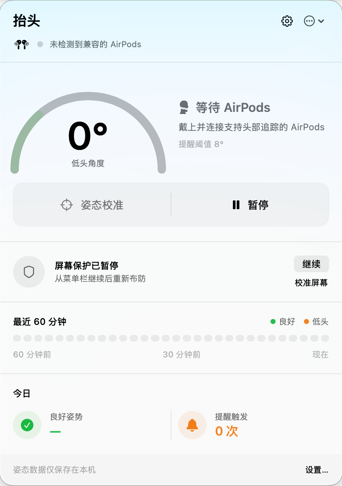
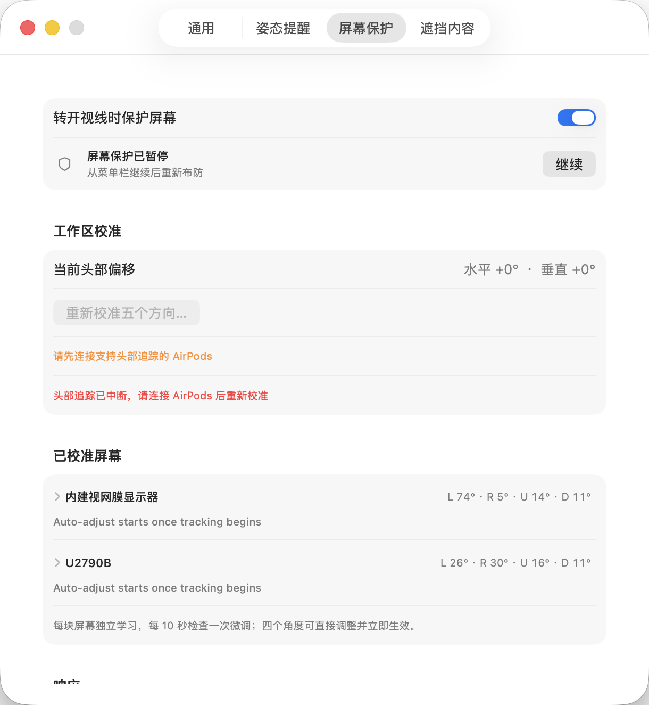
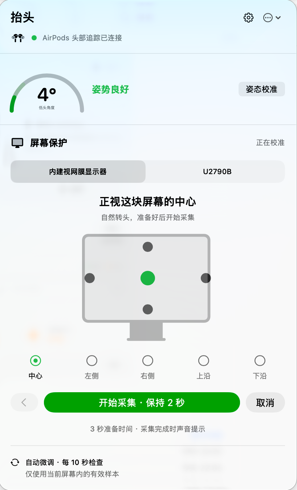
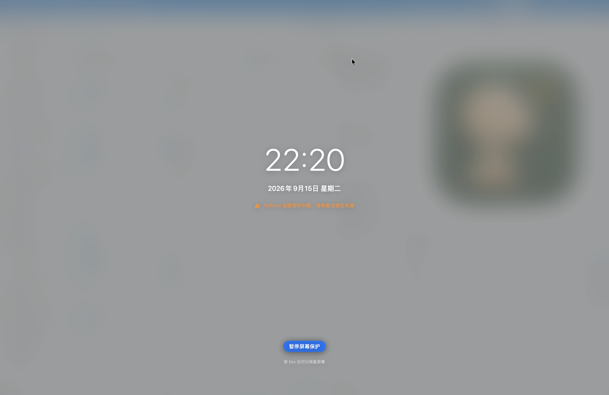
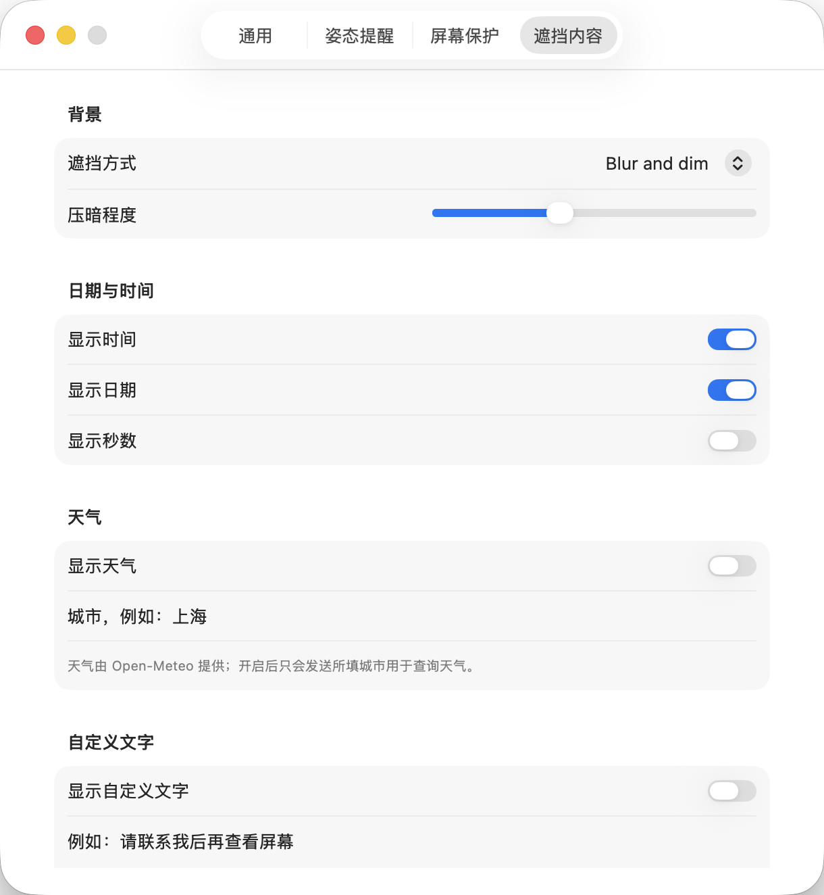
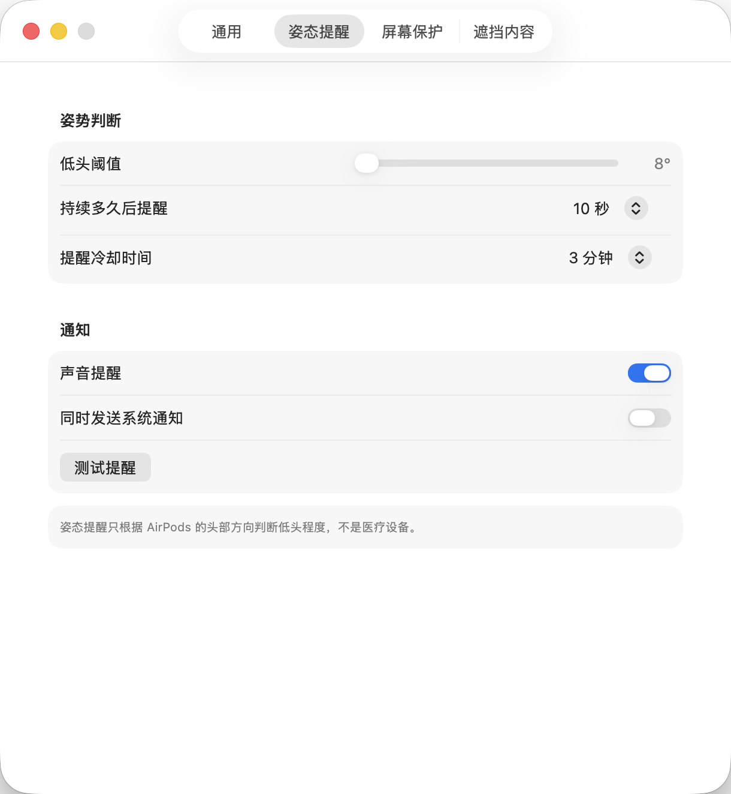
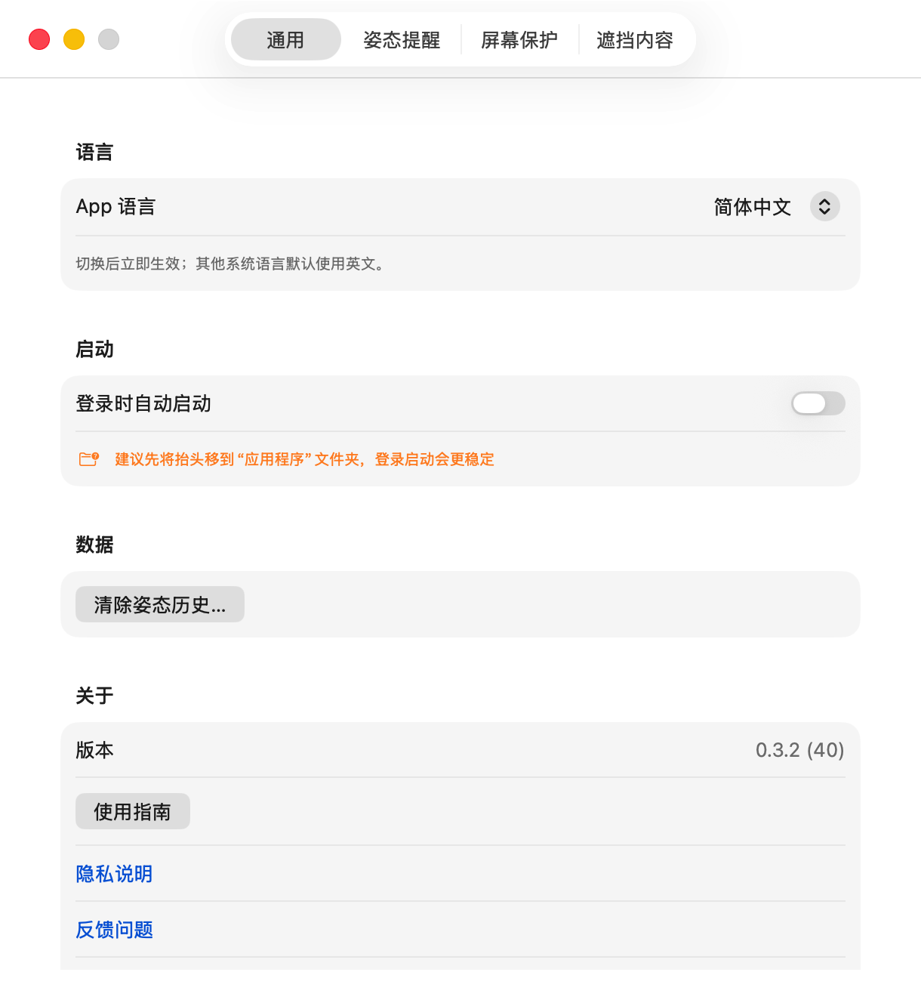

# 抬头 HeadUp

[English](README.md) · [简体中文](README.zh-CN.md)

**戴着 AirPods 工作时，HeadUp 一边帮你照顾颈椎，一边在你转头离开时自动遮挡屏幕。** 它常驻 Mac 菜单栏、不使用摄像头；头部回到屏幕前，遮挡自动消失，可以直接继续工作。

<p align="center">
  
</p>

## 功能一览

- **转头自动防窥**：头部离开工作范围后模糊并压暗所有显示器，回看即自动恢复
- **四向识别**：向左、向右、仰头、低头，每个方向都有独立边界
- **多显示器支持**：一次遮挡全部屏幕，每块屏还能单独设置左右上下四个角度
- **漂移自动修正**：逐屏学习并抵消头部姿态的缓慢漂移，戴得再久边界也不会越偏越多
- **低头提醒**：持续低头超时后，用通知、提示音或屏幕提示提醒你抬头
- **遮挡即信息页**：遮挡时可显示时间、天气或自定义文字，支持模糊压暗与纯色两种背景
- **AirPods 友好**：摘下单只耳机、短暂重连都不会丢失校准，按 `Esc` 可随时紧急恢复

## 转头离开时，自动保护屏幕

在办公室和共享空间里，转身和同事说话、低头找东西，或起身离开座位时，HeadUp 会在头部越过工作边界的瞬间自动模糊并压暗所有屏幕，减少聊天记录、客户资料和内部文档被旁人看到的机会。

<p align="center">
  
</p>

开启后，HeadUp 会引导你为工作区中的每块屏幕依次采集中心、左侧、右侧、上沿和下沿位置。

<p align="center">
  
</p>

- 同时识别向左、向右、仰头、低头，不会只盯着一个方向
- 支持多个显示器，一次遮挡全部屏幕
- **每块屏幕的四个角度都能单独微调，改完立即生效，不必重新校准**
- 内置漂移自动修正：逐屏学习 AirPods 姿态的缓慢偏移并持续抵消，长时间使用边界也不跑偏
- 回到工作范围后自动恢复，无需点击或解锁
- 临时摘下一只耳机不会清空设置；单显示器重连后自动恢复，多显示器只需正视屏幕中心点一下"对准这里"，都不必重新校准
- 紧急时按 `Esc`，立即显示屏幕并暂停保护

遮挡已开启时，如果 AirPods 头部追踪中断，遮挡会保持显示，并明确提示你重新连接后再校准，随后恢复保护。

<p align="center">
  
</p>

遮挡画面也可以是一张安静的信息页，你可以选择显示什么：

<p align="center">
  
</p>

- 系统日期和时间，可选是否显示秒数
- 当前天气（由 Open-Meteo 提供，默认关闭）
- 自己写的一句话，例如“马上回来”或公司访客提示
- 模糊压暗的桌面，或纯色背景，压暗程度可调

## 低头太久，提醒你抬头

HeadUp 会学习你坐直和平常低头时的角度。当你持续低头超过设定时间，它会通过通知、提示音或屏幕提示提醒你活动一下。

<p align="center">
  
</p>

菜单栏面板随时显示当前低头角度、提醒倒计时、最近 60 分钟的姿态变化，以及今天保持良好姿态的比例（见顶部面板图）。

## 三分钟开始使用

1. 将支持头部追踪的 AirPods 连接到 Mac，并打开 HeadUp。
2. 首次使用时，允许“运动与健身”权限。
3. 按引导完成两步姿态校准：坐直看屏幕，再自然低头。
4. 如果要使用屏幕保护，在 **设置 → 屏幕保护** 中打开功能，并依次看向工作区中心、最左、最右、最高和最低位置。
5. 在 **设置 → 遮挡内容** 中选择遮挡样式，以及是否显示时间、天气和自定义文字。

四向校准是为了适应你的桌面：单屏、双屏、上下摆放的屏幕都可以有不同的工作范围；校准后每块屏的四个角度仍可随时单独微调。完成一次后，普通的耳机切换和短暂断连不会要求你重新设置。

通用设置中可以切换应用语言、设为登录时启动，并查看更新、隐私和支持链接。

<p align="center">
  
</p>

首次启动会显示简短的使用指南，之后可以从菜单栏面板右上角的菜单再次打开。

## 隐私

HeadUp 使用 AirPods 提供的头部方向数据，不使用摄像头，也不会判断你在看屏幕上的哪一项内容。头部角度和姿态记录只保存在这台 Mac 上。

天气功能默认关闭。打开后，只会把你填写的城市发送给 Open-Meteo 查询天气。更多说明见 [PRIVACY.md](PRIVACY.md)。

## 系统要求

- macOS 14 或更高版本
- 支持头部追踪并已连接到 Mac 的 AirPods 或 Beats
- “运动与健身”权限；通知权限为可选项

## 下载与安装

项目目前还没有经过 Apple 公证的公开安装包，正式版本之后会发布在 [GitHub Releases](https://github.com/breezedeus/head-up/releases)。当前可以从源码构建体验：

```bash
./script/build_and_run.sh
```

应用会生成在 `dist/HeadUp.app`。如果遇到连接、权限或提醒问题，请查看 [SUPPORT.md](SUPPORT.md)。

## 开发者信息

### 常用命令

```bash
# 构建并启动，产物在 dist/HeadUp.app
./script/build_and_run.sh

# 只构建，不启动
./script/build_and_run.sh build

# 启动后跟随日志（--telemetry 只看本应用的 subsystem）
./script/build_and_run.sh --logs
./script/build_and_run.sh --telemetry

# lldb 调试
./script/build_and_run.sh --debug

# 跑测试；--verify 会启动一次确认进程活着
swift test
./script/build_and_run.sh --verify
```

`HEADUP_PREVIEW=1` 会以 `-DHEADUP_DEBUG` 编译，保留漂移诊断的逐秒日志（样本归属、速度门控、每屏修正后的中心与偏移）；正式构建里这些高频日志会被编译移除。

```bash
# preview 调试构建，配合 --logs 看漂移日志
HEADUP_PREVIEW=1 ./script/build_and_run.sh --logs

# preview 发布包：ad-hoc 签名，不需要 Developer ID，也不做公证
HEADUP_PREVIEW=1 HEADUP_SIGNING_IDENTITY=- ./script/package_release.sh
```

产物都在 `dist/release/`。`-preview` 只加在压缩包名上，解压出来仍是 `HeadUp.app`：

| 命令 | 压缩包 | 解压后 |
| --- | --- | --- |
| `./script/package_release.sh` | `HeadUp-<版本>.zip` | `HeadUp.app` |
| `HEADUP_PREVIEW=1 …` | `HeadUp-preview-<版本>.zip` | `HeadUp.app` |

preview 包的 Info.plist 里带 `HeadUpPreviewBuild = true`，可以据此区分。`build_and_run.sh` 的 `dist/HeadUp.app` 不带后缀——它不产出压缩包，preview 和正式构建互相覆盖同一路径。

完整的签名、公证、发布流程见 [RELEASING.md](RELEASING.md)。HeadUp 只能根据 AirPods 的姿态数据识别头部方向，无法判断含胸、弯腰、肩膀位置或坐姿与站姿，也不属于医疗设备。
